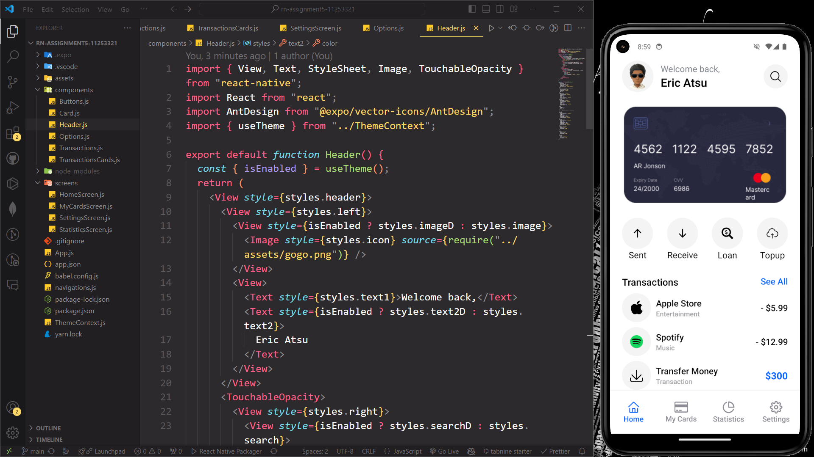
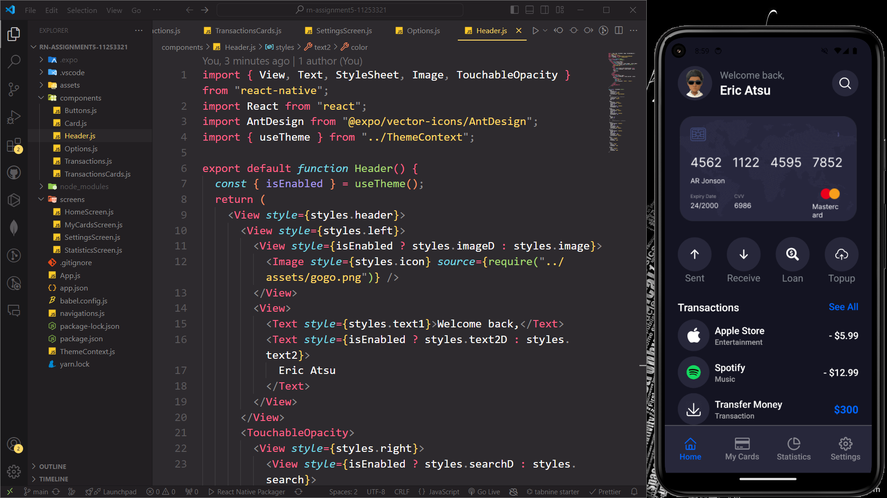
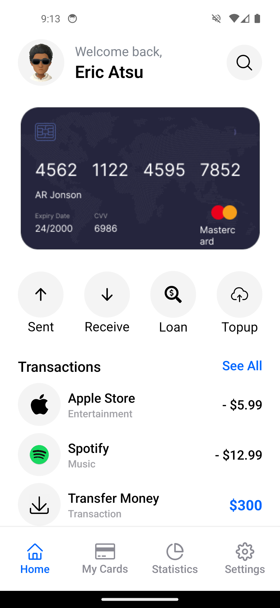
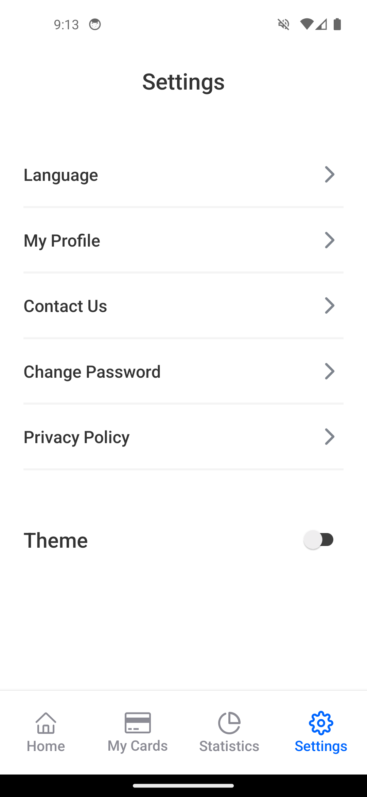
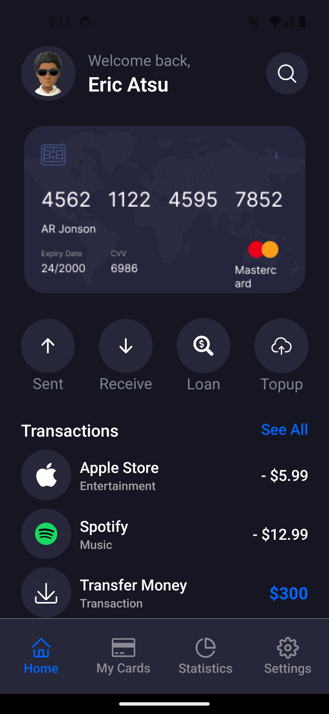
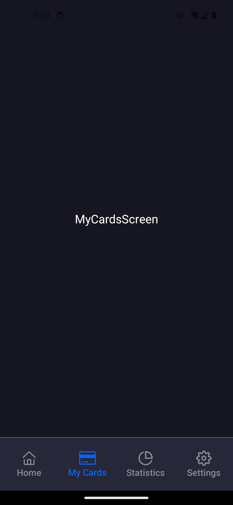
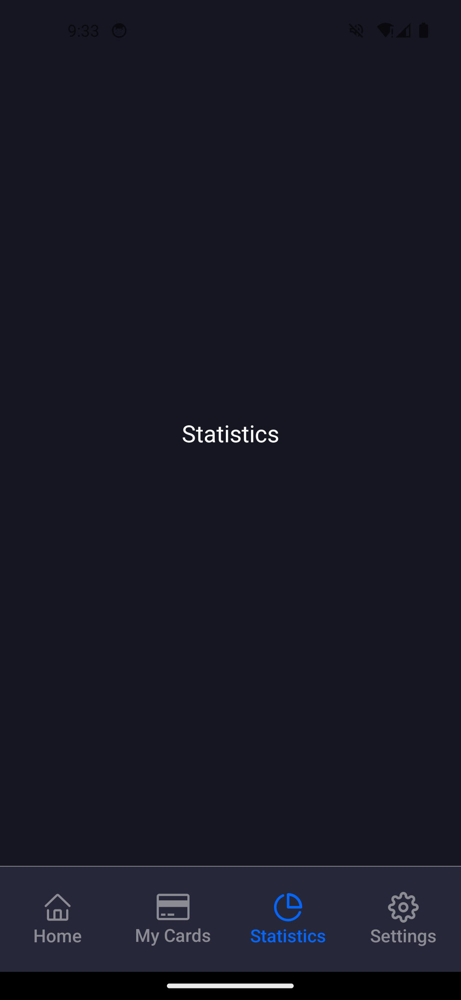
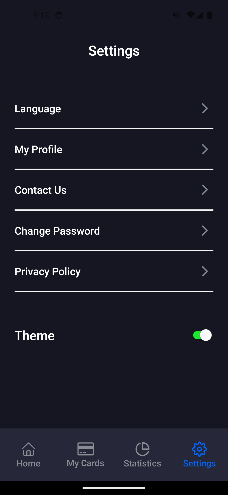

#

# SCREENSHOT OF APPLICATION

#

## How the Application was built

### I created Screens and used BottomTabNavigator from react-native for my navigation. A component folder was built and components that were used in the screens where created there and the imported. Lastly i used createContext, useState and useContext from react to set up my darkTheme.

 **1**
 **2**
 **3**
 **4**
 **5**
 **6**
